<div align="center">

# firecast-id — Indonesia Fire Hotspot Forecast Benchmark

**firecast-id is a forecast benchmark for daily active-fire hotspot counts in Indonesia. It takes NASA FIRMS detections through these steps to give tested forecasts for 1 to 30 days ahead:**

`clean detections` → `build daily series` → `build windows` → `tune on a validation year` → `backtest and test`.


**[Summary](#1-summary)** ·
**[Workflow](#4-the-end-to-end-workflow)** ·
**[Run it](#10-how-to-run-firecast-id)** ·
**[Configuration](#104-environment-variables)** ·
**[Known problems](#13-known-problems)** ·
**[Glossary](#15-glossary)**

</div>

> [!NOTE]
> This README uses ASD-STE100 Simplified Technical English. The writing rules and the project
> vocabulary are in [`docs/ste-style-guide.md`](docs/ste-style-guide.md). Each term in the
> [Glossary](#15-glossary) has only one meaning.

---

firecast-id turns NASA FIRMS fire detections into a clean daily count series for Indonesia and compares forecast models on it. The main idea is a strict evaluation protocol. Each target has its own date, and tuning uses a separate validation year. Every model must beat three baselines. A Diebold-Mariano test on daily errors decides if a difference is significant.

This README is the **one location that explains all of firecast-id**. It gives these topics:

- the general design
- each component and its procedure, step by step
- the decision rules
- the data map
- the runbook
- the validation results and the known problems

| If you are… | Read |
|---|---|
| A manager or reviewer | [1](#1-summary), [3](#3-design-rules), [4](#4-the-end-to-end-workflow), [12](#12-validation-results), [14](#14-key-points) |
| A developer who joins the project | All sections, in sequence. Keep [10](#10-how-to-run-firecast-id) and [13](#13-known-problems) open while you work |
| An operator who runs firecast-id | [10](#10-how-to-run-firecast-id), then the section for the component that you use |

---

## Table of contents

1. 🧭 [Summary](#1-summary)
2. 🏗️ [How firecast-id is built](#2-how-firecast-id-is-built)
   - 2.1 [Components](#21-components)
   - 2.2 [System context](#22-system-context)
   - 2.3 [Repository layout](#23-repository-layout)
3. 🛡️ [Design rules](#3-design-rules)
4. 🔄 [The end-to-end workflow](#4-the-end-to-end-workflow)
   - 4.1 [Full flow](#41-full-flow)
   - 4.2 [The life cycle of one test year](#42-the-life-cycle-of-one-test-year)
   - 4.3 [Who does which step](#43-who-does-which-step)
5. 🔵 [Detection cleaning and the daily series](#5-detection-cleaning-and-the-daily-series)
6. 🟢 [Windows and features](#6-windows-and-features)
7. 🟣 [Models and tuning](#7-models-and-tuning)
8. ⚖️ [The backtest and the significance test](#8-the-backtest-and-the-significance-test)
9. 🗂️ [Data and file map](#9-data-and-file-map)
10. ▶️ [How to run firecast-id](#10-how-to-run-firecast-id)
    - 10.1 [Prerequisites](#101-prerequisites) · 10.2 [Installation](#102-installation) · 10.3 [Run firecast-id](#103-run-firecast-id) · 10.4 [Environment variables](#104-environment-variables)
11. 🧩 [How to extend firecast-id](#11-how-to-extend-firecast-id)
12. ✅ [Validation results](#12-validation-results)
13. ⚠️ [Known problems](#13-known-problems)
14. 📌 [Key points](#14-key-points)
15. 📖 [Glossary](#15-glossary)
16. 📄 [License](#16-license)

---

## 1. Summary

**The problem.** Fire hotspot counts in Indonesia change from almost zero in the wet season to thousands per day in a dry El Niño year. A forecast benchmark must answer these questions:

- Which detections are vegetation fires, and which are gas flares, volcanoes or noise?
- Does each forecast get compared with the value of its own target date?
- Is a model better than "the same as today" or "the same day last year"?
- Is a difference between two models larger than chance?

firecast-id gives each of these questions its own component. The same code does the backtest and the final forecast.

| Item | Value |
|---|---|
| Input | FIRMS detection CSV files (or the FIRMS API), optional monthly climate drivers |
| Output | Daily forecasts for each horizon, metrics per model, horizon and test year, Diebold-Mariano tests |
| Components | **7**: detection cleaning, climate alignment, windows and features, models, tuning, backtest, metrics and tests |
| Providers | NASA FIRMS API (optional, needs `FIRMS_MAP_KEY`) |
| Offline mode | Everything except `firecast fetch`. A synthetic generator feeds the demo and the tests |
| Safety | Each feature reads days on or before the origin only. Tuning never reads the test year |
| Tests | **50** unit tests pass in CI (`pytest`), 1 skips without the `deep` extra (PyTorch). With the extra: 51 pass |

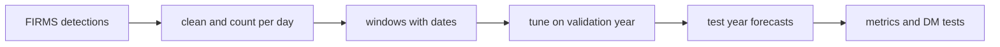

---

## 2. How firecast-id is built

### 2.1 Components

| Component | Module | Purpose |
|---|---|---|
| Settings | `src/firecast_id/config.py` | Environment variables and `.env`, with checks |
| Detection cleaning | `src/firecast_id/firms.py` | Read, validate and filter detections, count them per day, load the series |
| FIRMS sources | `src/firecast_id/firms.py` | `FolderSource` (local CSV) and `FirmsApiSource` (API) behind one interface |
| Climate alignment | `src/firecast_id/climate.py` | Monthly drivers, used only after publication |
| Synthetic data | `src/firecast_id/synthetic.py` | Daily series, climate file and detection rows with a known process |
| Windows and features | `src/firecast_id/features.py` | One windowing function with dates, feature rows per horizon |
| Models | `src/firecast_id/models.py` | Three baselines, ridge on log counts, Poisson gradient boosting |
| Deep model | `src/firecast_id/deep.py` | LSTM with a Poisson loss (optional extra `deep`, PyTorch) |
| Tuning | `src/firecast_id/tuning.py` | Seeded search on a validation year |
| Backtest | `src/firecast_id/backtest.py` | Year-by-year backtest, metrics, Diebold-Mariano tests |
| Metrics | `src/firecast_id/metrics.py` | MAE, RMSE, MASE, peak-season MAE, Poisson deviance, DM test |
| Final forecast | `src/firecast_id/pipeline.py` | Model input with climate columns, final fit and forecast |
| CLI | `src/firecast_id/cli.py` | The `firecast` command |

The component map shows which module calls which module. An arrow points from the caller to the module that it uses.

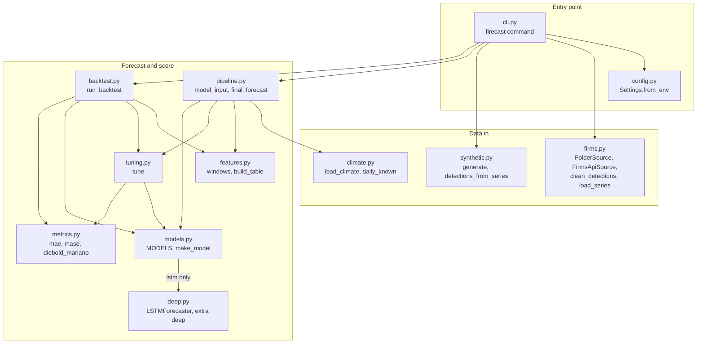

### 2.2 System context

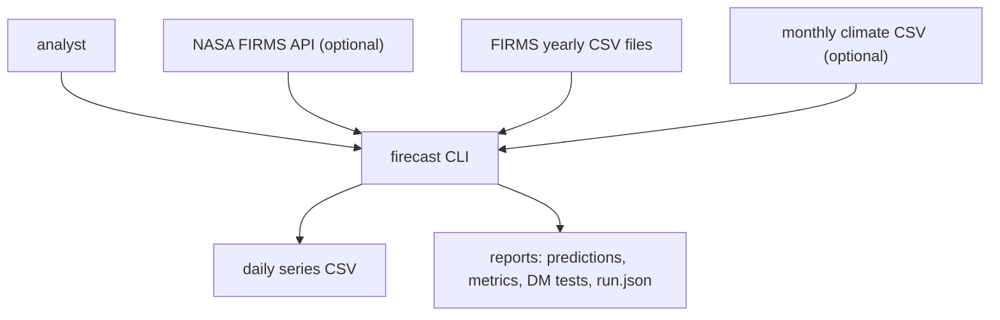

### 2.3 Repository layout

```
firecast-id/
├── .github/workflows/ci.yml   # pytest on Python 3.11
├── data/README.md             # sources, terms, columns, download steps (no data files)
├── docs/ste-style-guide.md    # writing rules and project vocabulary
├── src/firecast_id/           # the package (one module per component, see 2.1)
├── tests/                     # 51 offline tests on synthetic data (1 needs PyTorch)
├── .env.example               # variable names only
├── pyproject.toml             # dependencies, extras, the firecast command
└── LICENSE                    # MIT
```

---

## 3. Design rules

### 3.1 One windowing function with dates
`features.windows` is the only function that pairs inputs with a target. Each feature row carries its origin date and its target date. The backtest scores each forecast against the count of its own target date.

### 3.2 A clean target on a complete calendar
The daily count includes only vegetation fires (`type == 0`) with a confidence of 30 or more. The series has one row for each calendar day. A day with no kept detection has a count of 0.

### 3.3 A validation year for the search
The search for test year Y fits on target dates before Y-1 and scores on Y-1. The refit for Y uses all target dates before Y. No step reads year Y before the forecast.

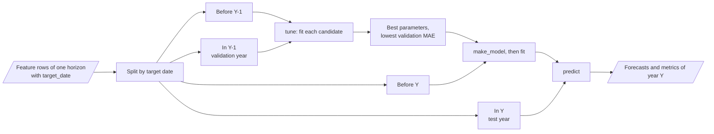

### 3.4 Baselines first
Each backtest can include `persistence`, `seasonal_naive` and `climatology`. The Diebold-Mariano tests compare every model with one reference baseline: the first of `persistence`, `seasonal_naive` and `climatology` that is in the model list.

### 3.5 Valid comparisons
The significance test uses the daily errors of two models on the same target dates. It uses a Newey-West variance and the Harvey-Leybourne-Newbold correction. There is no t-test on three yearly values.

### 3.6 Reproducible runs
All models and the search use `FIRECAST_SEED`. The backtest writes `run.json` with the settings, the features, every tuning trial and the best parameters. There is one deep-learning framework (PyTorch), and it is optional.

### 3.7 The documented features are the used features
The backtest prints the feature list and writes it to `run.json`. Section 6 lists the same features.

---

## 4. The end-to-end workflow

### 4.1 Full flow

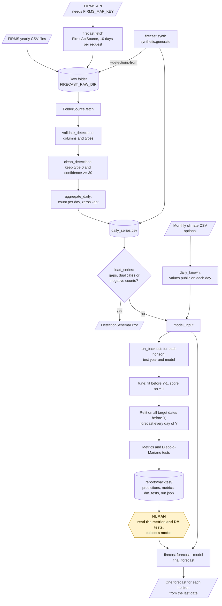

### 4.2 The life cycle of one test year

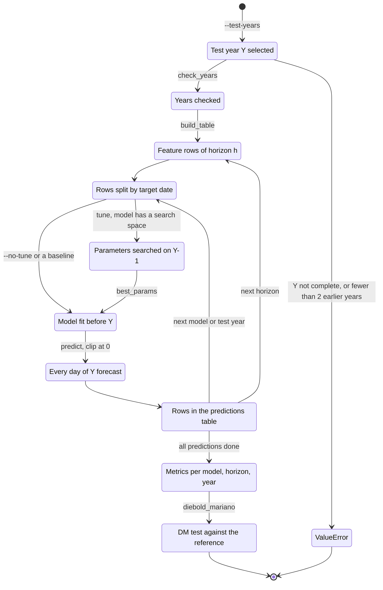

1. Select test year Y. The series must contain Y-2, Y-1 and all of Y.
2. Build the feature rows for one horizon h.
3. Split the rows by target date: before Y-1, in Y-1, before Y, in Y.
4. Search the parameters: fit before Y-1, score the MAE on Y-1.
5. Fit a new model with the best parameters on all rows before Y.
6. Forecast every target date in Y. Early January rows have December origins.
7. Score the forecasts against the counts of their target dates.
8. Do the same for each horizon and each model.

### 4.3 Who does which step

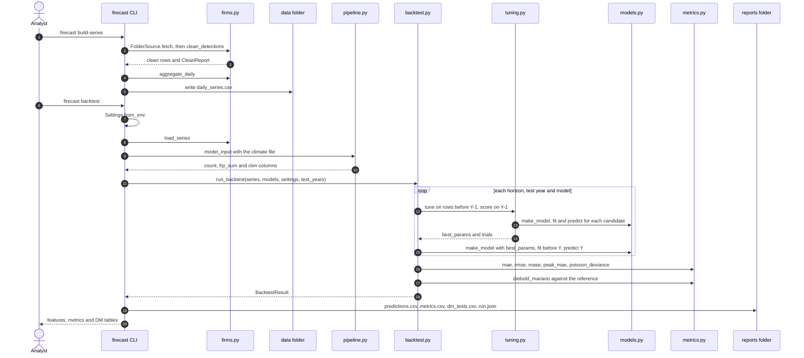

---

## 5. Detection cleaning and the daily series

**Purpose.** Make a daily count of vegetation fires with no missing days.

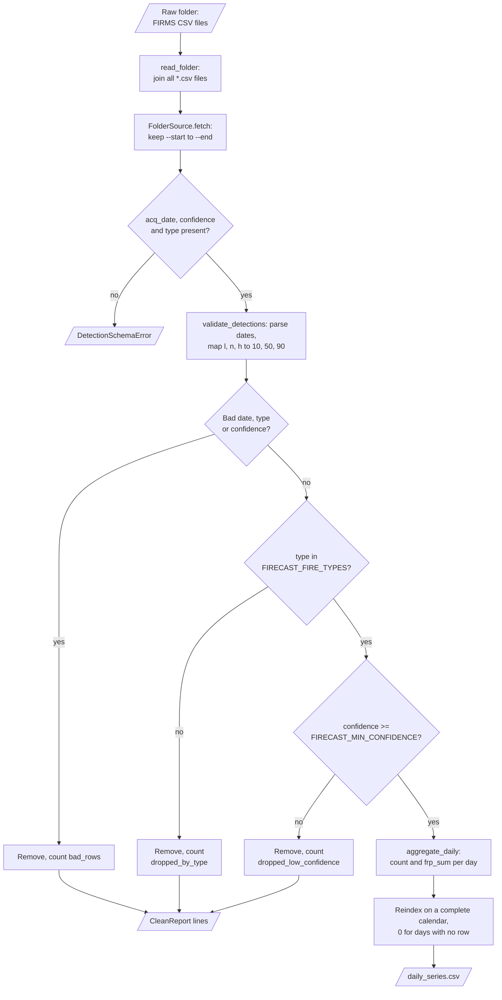

| Input | Output |
|---|---|
| FIRMS CSV rows (`acq_date`, `confidence`, `type`, `frp`) | `daily_series.csv` with `date`, `count`, `frp_sum`, and a cleaning report |

The FIRMS API source fills the raw folder. `firecast fetch` cuts the date range into requests of 10 days or less.

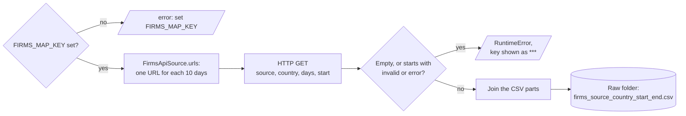

**Procedure**

1. Read all CSV files in the folder (`FolderSource`). `firecast fetch` downloads them first from the API (`FirmsApiSource`, 10 days per request).
2. Check that `acq_date`, `confidence` and `type` are present.
3. Read VIIRS confidence classes `l`, `n`, `h` as 10, 50 and 90.
4. Count and remove rows with a bad date, type or confidence.
5. Remove rows whose `type` is not in `FIRECAST_FIRE_TYPES`. Report the count per type.
6. Remove rows with a confidence below `FIRECAST_MIN_CONFIDENCE`. Report the count.
7. Count the rows and add the `frp` values per day.
8. Put the counts on a complete calendar. Write 0 for days with no row.

**Rules**

- `load_series` refuses a series with calendar gaps, duplicate dates or negative counts.
- The API key never appears in an error message.
- A monthly climate value is used only from month end + `FIRECAST_CLIMATE_LAG_DAYS`.

| `type` | Meaning | Default |
|---|---|---|
| 0 | Presumed vegetation fire | Kept |
| 1 | Active volcano | Removed |
| 2 | Other static land source (for example gas flares) | Removed |
| 3 | Offshore | Removed |

`backtest` and `forecast` read the daily series and join the climate values that were public on each day (`pipeline.model_input`).

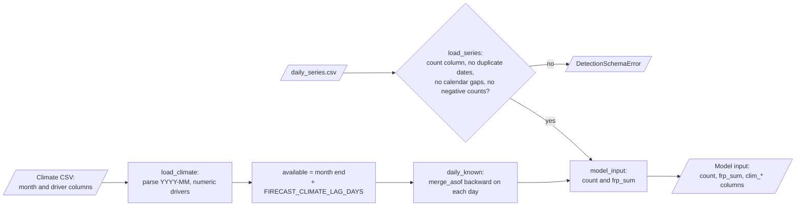

---

## 6. Windows and features

**Purpose.** Give each model the same leak-free description of the past and of the target date.

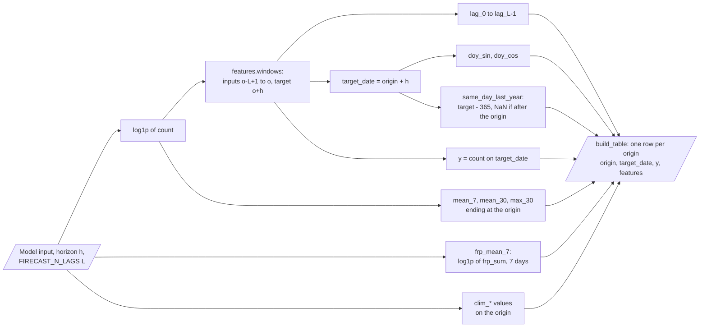

| Input | Output |
|---|---|
| Model input (daily `count`, `frp_sum`, `clim_*`), horizon h, number of lags L | One feature row per origin, with `origin`, `target_date` and `y` |

**Procedure**

1. Take log(1 + count) of the series.
2. Make windows with `features.windows`: inputs on days o-L+1 .. o, target on day o+h.
3. Calculate the rolling values that end at the origin.
4. Read the calendar values of the target date.
5. Read the climate values that were public on the origin.

| Feature | Meaning |
|---|---|
| `lag_0` … `lag_{L-1}` | log(1 + count) on the origin and the L-1 days before it (L = `FIRECAST_N_LAGS`, default 14) |
| `mean_7`, `mean_30`, `max_30` | Mean or maximum of log(1 + count) over the 7 or 30 days that end at the origin |
| `frp_mean_7` | Mean of log(1 + daily FRP sum) over the 7 days that end at the origin |
| `same_day_last_year` | log(1 + count) 365 days before the target date |
| `doy_sin`, `doy_cos` | Day of the year of the target date on a circle |
| `clim_<name>` | Each climate driver, as public on the origin (only with a climate file) |

**Rules**

- There is one model per horizon (a direct forecast). No forecast goes back into a feature.
- Windows run over the full series. A test year does not start with a gap of L days.
- The features are univariate counts, FRP sums, calendar values and optional climate values. Brightness is not a feature.

---

## 7. Models and tuning

**Purpose.** Give forecasts of the expected daily count from several model types behind one interface.

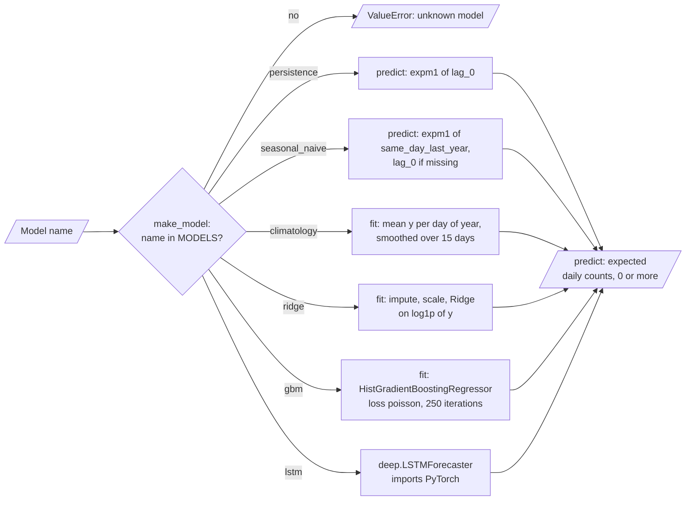

| Model | Type | Fit | Search space |
|---|---|---|---|
| `persistence` | Baseline | None: the count on the origin | — |
| `seasonal_naive` | Baseline | None: the count 365 days before the target date | — |
| `climatology` | Baseline | Mean count per day of the year in the training rows, ±7 days | — |
| `ridge` | Linear | Pipeline: median imputation, scaling, `Ridge` on log(1 + count) | `alpha` 0.1, 1, 10, 100 |
| `gbm` | Trees | `HistGradientBoostingRegressor(loss="poisson")`, 250 iterations | `learning_rate`, `max_leaf_nodes`, `min_samples_leaf`, `l2_regularization` (24 sets) |
| `lstm` | Deep, optional | LSTM over the lag window + other features, Poisson loss, early stop on the validation year | `hidden` 16, 32 and `lr` 0.001, 0.003 |

**Procedure (tuning)**

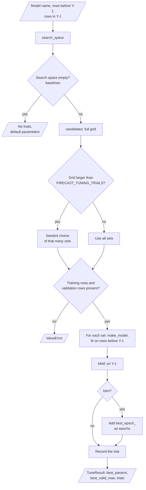

1. Make the full grid of the search space.
2. If the grid is larger than `FIRECAST_TUNING_TRIALS`, select that many sets with the seed.
3. Fit each set on the rows before the validation year.
4. Score the MAE on the validation year.
5. Keep the set with the lowest MAE. For `lstm`, also keep the best epoch count.

**Rules**

- Each preprocessing step is in a pipeline that is fit on the training rows only.
- Each fit makes a new model object. No fold model is used again.
- `gbm` uses `FIRECAST_THREADS` threads (default 1). The LSTM uses the same number of PyTorch threads.
- `lstm` imports PyTorch only when you select it.

The LSTM (`deep.LSTMForecaster`) reads the lag window as a sequence. The other features join the last hidden state.

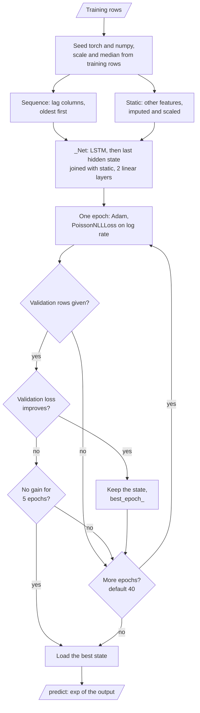

`firecast forecast` uses the same models and the same tuning (`pipeline.final_forecast`).

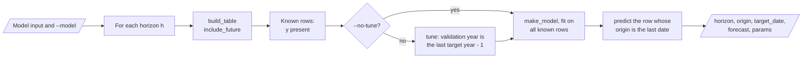

---

## 8. The backtest and the significance test

**Purpose.** Score every model for each horizon and test year, and test if its errors differ from the errors of the reference baseline.

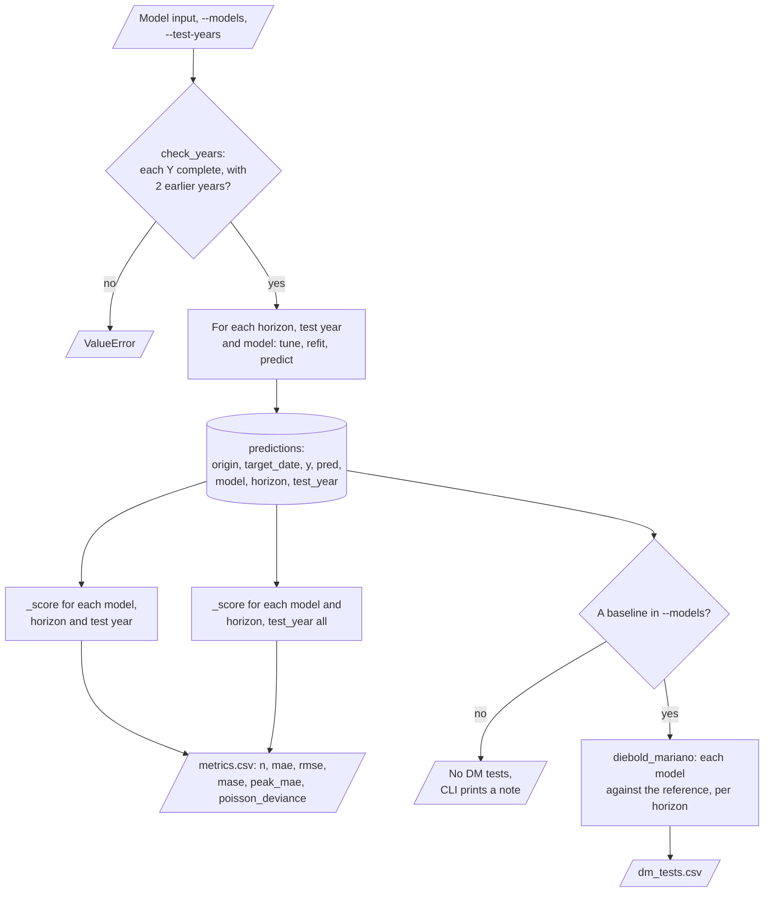

| Metric | Meaning |
|---|---|
| `mae` | Mean absolute error in hotspots per day |
| `rmse` | Root mean squared error |
| `mase` | MAE divided by the mean absolute one-day change of the training series |
| `peak_mae` | MAE on target dates in `FIRECAST_PEAK_MONTHS` (default August, September, October) |
| `poisson_deviance` | Mean Poisson deviance of the counts |

**Diebold-Mariano test**

| Item | Value |
|---|---|
| Loss difference | \|error of the model\| − \|error of the reference\| per target date |
| Variance | Newey-West (Bartlett weights) with h − 1 lags |
| Correction | Harvey-Leybourne-Newbold small-sample factor |
| p-value | Two-sided, t distribution with n − 1 degrees of freedom |
| Reference | The first of `persistence`, `seasonal_naive` and `climatology` that is in `--models` (default `persistence`) |
| Reading | A negative statistic and a p-value below 0.05: the model has a lower absolute error than the reference |

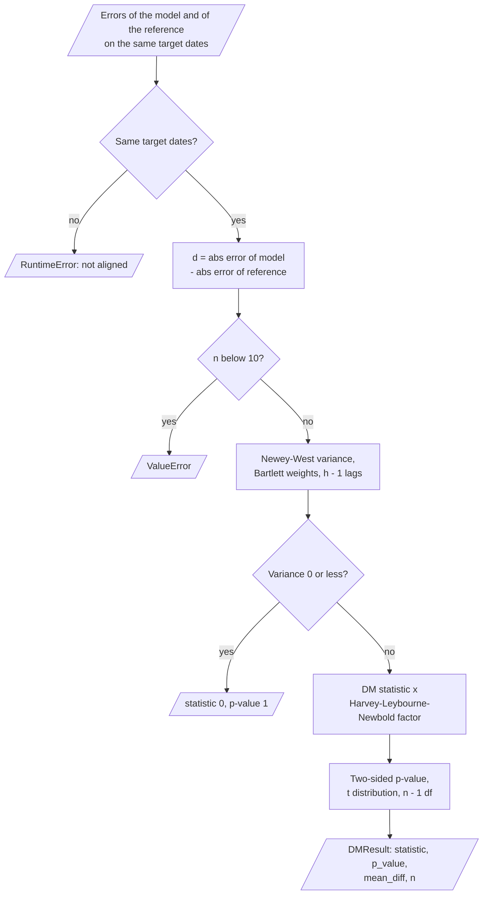

**Rules**

- A test year must be complete, and the series must have two earlier years.
- Every day of each test year gets a forecast for every horizon.
- The DM test refuses two prediction tables that do not have the same target dates.

---

## 9. Data and file map

| Path | Committed? | Contents |
|---|---|---|
| `data/README.md` | Yes | Sources, terms, columns and download steps |
| `data/modis_indonesia/*.csv` | No (git ignores it) | FIRMS yearly detection files |
| `data/daily_series.csv` | No (git ignores it) | Output of `firecast build-series` |
| `data/synthetic/` | No (git ignores it) | Output of `firecast synth` |
| `reports/backtest/predictions.csv` | No (git ignores it) | One row per model, horizon, test year and target date |
| `reports/backtest/metrics.csv` | No (git ignores it) | Metrics per model, horizon and test year, and for all years |
| `reports/backtest/dm_tests.csv` | No (git ignores it) | DM statistic, p-value and mean error difference |
| `reports/backtest/run.json` | No (git ignores it) | Settings, features, tuning trials and best parameters |
| `reports/demo/` | No (git ignores it) | Synthetic files and backtest reports of `firecast demo` |
| `.env` | No (git ignores it) | Local settings and `FIRMS_MAP_KEY` |

---

## 10. How to run firecast-id

### 10.1 Prerequisites

| Need | For |
|---|---|
| Python 3.11+ | All components |
| numpy, pandas, scikit-learn, scipy | Core (installed with the package) |
| PyTorch (extra `deep`) | The `lstm` model only |
| A free FIRMS MAP_KEY | `firecast fetch` only |

### 10.2 Installation

```bash
git clone https://github.com/KrishnaAnnavaram/firecast-id.git
cd firecast-id
python -m venv .venv
. .venv/bin/activate            # Windows: .venv\Scripts\activate
pip install -e ".[dev]"         # add ,deep for the LSTM
```

### 10.3 Run firecast-id

```bash
# Offline demo: synthetic 2012-2023, 5 models, 4 horizons, test years 2021-2023 (about 45 seconds)
firecast demo

# Synthetic files, then each step
firecast synth --out-dir data/synthetic --detections-from 2022
firecast build-series --raw-dir data/synthetic/raw --out data/synthetic/rebuilt.csv
firecast backtest --series data/synthetic/daily_series.csv --climate data/synthetic/climate.csv \
                  --models persistence,seasonal_naive,climatology,ridge,gbm --test-years 2021,2022,2023
firecast forecast --series data/synthetic/daily_series.csv --climate data/synthetic/climate.csv --model gbm

# Real FIRMS data: yearly files in data/modis_indonesia/ (see data/README.md), or the API
firecast fetch --start 2023-01-01 --end 2023-12-31      # needs FIRMS_MAP_KEY
firecast build-series
firecast backtest
pytest -q
```

| Command | Result |
|---|---|
| `firecast synth` | Writes `daily_series.csv`, `climate.csv` and, with `--detections-from`, detection files |
| `firecast build-series` | Cleans the detections, prints the cleaning report, writes the daily series |
| `firecast fetch` | Downloads detections from the FIRMS API into the raw folder |
| `firecast backtest` | Prints the features, the metrics and the DM tests, and writes the reports |
| `firecast forecast` | Prints one forecast per horizon from the last date of the series |
| `firecast demo` | Runs `synth` and `backtest` on synthetic data |

Add `--no-tune` to `backtest` or `forecast` to use the default parameters.

The diagram shows the order of the commands and the files that connect them.

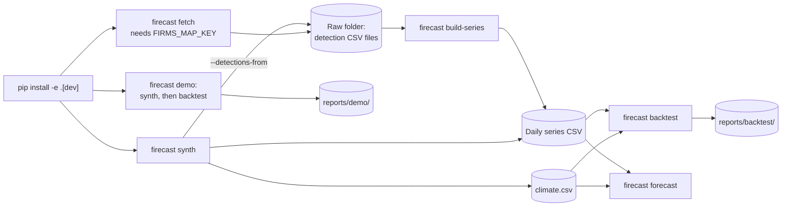

### 10.4 Environment variables

| Variable | Used by | Meaning |
|---|---|---|
| `FIRECAST_RAW_DIR` | `build-series`, `fetch` | Folder of detection CSV files, default `data/modis_indonesia` |
| `FIRECAST_SERIES` | `backtest`, `forecast`, `build-series` | Daily series CSV, default `data/daily_series.csv` |
| `FIRECAST_CLIMATE` | `backtest`, `forecast` | Monthly climate CSV, default none |
| `FIRECAST_OUTPUT_DIR` | `backtest`, `demo` | Reports folder, default `reports` |
| `FIRECAST_FIRE_TYPES` | `build-series` | Kept FIRMS types, default `0` |
| `FIRECAST_MIN_CONFIDENCE` | `build-series` | Lowest kept confidence, default 30 |
| `FIRECAST_HORIZONS` | backtest, forecast | Comma list of horizons in days, default `1,7,14,30` |
| `FIRECAST_N_LAGS` | features | Number of lag features, default 14 |
| `FIRECAST_PEAK_MONTHS` | metrics | Months of `peak_mae`, default `8,9,10` |
| `FIRECAST_CLIMATE_LAG_DAYS` | climate | Days after month end before a value is public, default 30 |
| `FIRECAST_SEED` | all models, tuning, `synth` | Random seed, default 42 |
| `FIRECAST_TUNING_TRIALS` | tuning | Maximum parameter sets per search, default 6 |
| `FIRECAST_THREADS` | `gbm`, `lstm` | Threads per fit, default 1 |
| `FIRMS_MAP_KEY` | `fetch` | FIRMS API key (credential) |
| `FIRMS_SOURCE` | `fetch` | FIRMS source, default `MODIS_SP` |
| `FIRMS_COUNTRY` | `fetch` | Country code, default `IDN` |

The settings come from the environment and from a local `.env` file. An environment variable wins over the `.env` file. Credentials are only in a local `.env` file. Git ignores this file. Do not print or commit credentials.

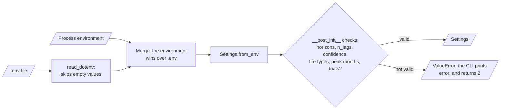

---

## 11. How to extend firecast-id

| You want to… | Do this | Code change? |
|---|---|---|
| Use VIIRS detections | Put the VIIRS files in the raw folder. The `l`/`n`/`h` classes are read | No |
| Add a climate driver | Add a column to the climate CSV | No |
| Change the horizons | Set `FIRECAST_HORIZONS` (1..365) | No |
| Add a model | Subclass `Forecaster`, set `space`, add it to `MODELS` | Small |
| Add an attention or Transformer model | Add a class in `deep.py` with the `LSTMForecaster` interface | Yes |
| Add a statistical model (SARIMAX, ETS) | Add a `Forecaster` that imports `statsmodels` inside `fit` | Yes |
| Forecast per province | Add a region filter on `latitude` and `longitude` before the daily count | Yes |

---

## 12. Validation results

| Validation | Result | Command |
|---|---|---|
| Unit tests (CI installs only `.[dev]`) | **50 passed, 1 skipped** (the LSTM test needs the `deep` extra) | `pytest -q` |
| Unit tests with the `deep` extra (PyTorch) | **51 passed** | `pytest -q` |
| Backtest on synthetic data | See the tables below | `firecast demo` |

The demo uses synthetic data from 2012 to 2023 (seed 42) with the synthetic climate file. Test years are 2021, 2022 and 2023, so each model has 1,095 scored days per horizon. **These numbers are synthetic.** They show that the pipeline works. They do not show the accuracy on FIRMS data.

| Horizon 1 (synthetic) | MAE | RMSE | MASE | Peak MAE |
|---|---|---|---|---|
| `ridge` | 50.1 | 198.2 | 0.73 | 167.5 |
| `gbm` | 52.4 | 215.4 | 0.76 | 175.5 |
| `persistence` | 58.7 | 197.1 | 0.86 | 191.6 |
| `climatology` | 74.0 | 235.1 | 1.08 | 258.8 |
| `seasonal_naive` | 97.2 | 337.3 | 1.42 | 339.2 |

| Horizon 30 (synthetic) | MAE | RMSE | MASE | Peak MAE |
|---|---|---|---|---|
| `gbm` | 55.6 | 221.4 | 0.81 | 185.8 |
| `ridge` | 62.0 | 247.0 | 0.91 | 210.5 |
| `climatology` | 74.0 | 235.1 | 1.08 | 258.8 |
| `seasonal_naive` | 97.2 | 337.3 | 1.42 | 339.2 |
| `persistence` | 99.0 | 324.9 | 1.44 | 242.6 |

| DM test against `persistence` (synthetic) | h = 1 | h = 7 | h = 14 | h = 30 |
|---|---|---|---|---|
| `ridge`: statistic (p-value) | −2.16 (0.031) | −2.67 (0.008) | −1.79 (0.073) | −1.71 (0.088) |
| `gbm`: statistic (p-value) | −1.36 (0.173) | −2.56 (0.010) | −1.88 (0.060) | −1.96 (0.050) |

On this synthetic data, `ridge` and `gbm` have a lower MAE than every baseline at every horizon. The DM test shows that only some of these differences are significant at the 5 % level. The difference between `ridge` and `gbm` is small at horizons 1 to 14. The demo does not include the LSTM, because PyTorch is optional.

The earlier prototype reported gains of 11.6 %, 20.3 % and 4.8 % for a Transformer on FIRMS data. These are prototype results, not reproduced here. The analysis of the prototype found an off-by-one error in their evaluation.

---

## 13. Known problems

Read these problems before you use firecast-id for decisions.

| # | Area | Problem | Impact and action |
|---|---|---|---|
| 1 | Data | Results on FIRMS data are not reproduced in CI, because the data is not in the repository. | Run `firecast build-series` and `firecast backtest` on FIRMS data before you trust a model. |
| 2 | Zero days | A day with no detection can also be a day with cloud cover or no satellite pass. | Low counts in the wet season are not only low fire activity. |
| 3 | Models | The attention LSTM and the Transformer of the prototype are not in this repository. | Add them through `deep.py`. Keep them only if they beat the baselines in the DM test. |
| 4 | Models | No SARIMAX or ETS model is included. | Add one as a `Forecaster` (Section 11). |
| 5 | Climate | The demo uses a synthetic climate file. Real ONI, DMI or rainfall values are not bundled. | Download them (see `data/README.md`) and set `FIRECAST_CLIMATE`. |
| 6 | Uncertainty | The models give expected counts only, with no prediction interval. | Use the Poisson deviance and the DM tests to compare models. Add quantile models for intervals. |
| 7 | Scale | The series is one count for all of Indonesia. | Regional forecasts need a region filter before the daily count. |
| 8 | Statistics | The DM tests do not correct for many comparisons (models × horizons). | Read p-values near 0.05 with care. |
| 9 | API | `firecast fetch` is not tested against the live FIRMS API in CI. | The tests use a fake opener. Check the first download by hand. |

---

## 14. Key points

1. **Each forecast has its own target date.** One windowing function returns the origin and the target date of each row.
2. **The target is vegetation fires only.** Volcanoes, static land sources, offshore detections and low-confidence detections are removed.
3. **The calendar is complete.** A day with no detection has a count of 0.
4. **Tuning uses a validation year.** The test year is not read before the forecast.
5. **Three baselines are part of the benchmark.** A model is useful only if it beats them.
6. **Significance comes from daily errors.** The Diebold-Mariano test replaces t-tests on three numbers.
7. **Runs are reproducible.** Seeds, settings and all tuning trials go into `run.json`.

---

## 15. Glossary

| Term | Meaning |
|---|---|
| **Baseline** | The model `persistence`, `seasonal_naive` or `climatology` |
| **Climate driver** | A monthly value such as ONI, DMI or rainfall |
| **Daily series** | The count of kept detections per calendar day, with `frp_sum` |
| **Detection** | One FIRMS row: one active-fire pixel at one time |
| **DM test** | The Diebold-Mariano test on the daily absolute errors of two models |
| **FRP** | Fire radiative power of a detection, in megawatts |
| **Horizon** | The number of days from the origin to the target date |
| **Kept detection** | A detection with a kept type and a confidence at or above the limit |
| **MASE** | MAE divided by the mean absolute one-day change of the training series |
| **Origin** | The last day with known counts when a forecast is made |
| **Peak season** | The months in `FIRECAST_PEAK_MONTHS` |
| **Publication lag** | The days after month end before a climate value is public |
| **Target date** | Origin + horizon |
| **Test year** | The calendar year that the backtest forecasts and scores |
| **Validation year** | The year before the test year, used only for tuning |
| **Window** | The lag values that end at the origin, with the target of one horizon |

---

## 16. License

[MIT](LICENSE) © 2026 Krishna Annavaram
